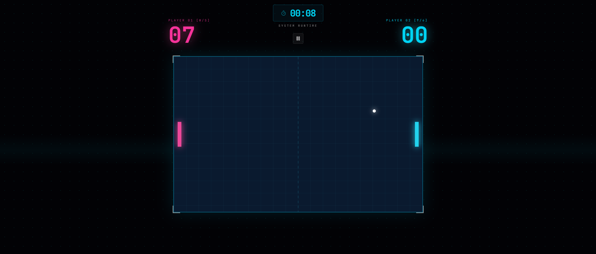

# ⚡ NEON-PONG: Cyberpunk Duel

A high-velocity, synthwave-inspired recreation of the classic Pong, designed **exclusively for 2-player local competition**. This project blends retro arcade mechanics with a "Night City" aesthetic, challenging two players to a battle of reflexes within a neon-drenched grid.

---


---

## 🎮 Live Demo
You can play the game live here: [https://animated-tapioca-567aa9.netlify.app/](https://animated-tapioca-567aa9.netlify.app/)

---

## 🚀 Key Features
* **Exclusively Multiplayer:** Built specifically for head-to-head local play—perfect for settling scores on a shared keyboard.
* **Neon-Aesthetic UI:** Immersive Cyberpunk visuals using CSS glow effects, high-contrast palettes, and futuristic typography.
* **High-Octane Physics:** Dynamic ball-velocity scaling that intensifies the game as the rally continues.
* **Responsive Dual-Control Layout:** Optimized input handling to support simultaneous movement for both players without ghosting or lag.

## 🛠️ Tech Stack
* **HTML5:** Canvas-based rendering and structure.
* **CSS3:** Custom neon-glow filters, keyframe animations, and responsive layout.
* **JavaScript (ES6+):** Multi-input event handling, collision vectors, and game state management.
* **Netlify:** Automated deployment and hosting.

## 🧠 Technical Deep Dive
1.  **Simultaneous Input Handling:** Implemented a robust keyboard listener system that tracks multiple simultaneous key presses, allowing both players to move independently and smoothly.
2.  **The Game Loop:** A high-performance rendering cycle ensuring a 60FPS experience for "twitch-reflex" gameplay.
3.  **Collision Math:** Calculation of reflection angles based on the ball’s impact point on the paddle, rewarding precision and strategy.

## 🕹️ Controls
| Player | Up | Down |
| :--- | :--- | :--- |
| **Player 1 (Left)** | `W` | `S` |
| **Player 2 (Right)** | `Arrow Up` | `Arrow Down` |

---

## 🔧 Installation & Setup
1.  Clone the repository:
    ```bash
    git clone [https://github.com/tu-usuario/nombre-del-repo.git](https://github.com/tu-usuario/nombre-del-repo.git)
    ```
2.  Navigate to the project folder:
    ```bash
    cd nombre-del-repo
    ```
3.  Open `index.html` in your browser or use a Live Server extension in VS Code.

## 🛣️ Roadmap
- [ ] Add Sound Effects (SFX) and Synthwave background music.
- [ ] Implementation of different difficulty levels (ball speed modifiers).
- [ ] Online Multiplayer via WebSockets.
- [ ] Customizable neon color palettes.

---
Developed with ⚡ by [BashJuno]([https://github.com/tu-usuario](https://github.com/BashJuno-18))
